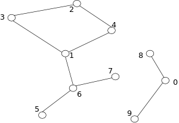

# PROJECT DESCRIPTION

The purpose of this project is to re-implement Graph Processing program using <b>Pregel on Spark GraphX</b>.

An undirected graph is represented in the input text file using one line per graph vertex.  
For example, the line   
1,2,3,4,5,6,7   
represents the vertex with ID 1, which is connected to the vertices with IDs 2, 3, 4, 5, 6, and 7.

For example, the following graph:

     is represented in the input file as follows:
3,2,1  
2,4,3  
1,3,4,6  
5,6  
6,5,7,1  
0,8,9  
4,2,1  
8,0  
9,0  
7,6  

That is, the program will find the <b> the connected components of any undirected graph and prints the size of these connected components</b>.   A connected component of a graph is a subgraph of the graph in which there is a path from any two vertices in the subgraph.   For the above graph, there are two connected components: one 0,8,9 and another 1,2,3,4,5,6,7. The program prints the sizes of these connected components: 3 and 7.

To compile and run the project navigate to the given directory and do the following steps:  
mvn install  
rm -rf output  
~/spark-1.5.2-bin-hadoop2.6/bin/spark-submit --class GraphComponents --master local[2] target/Histogram.jar small-graph.txt
